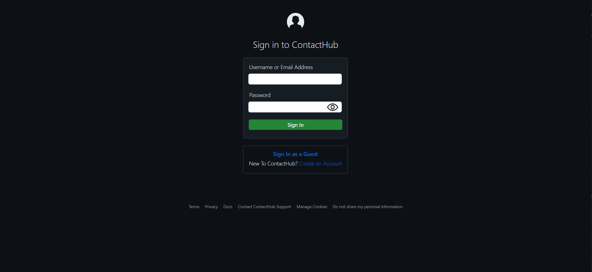
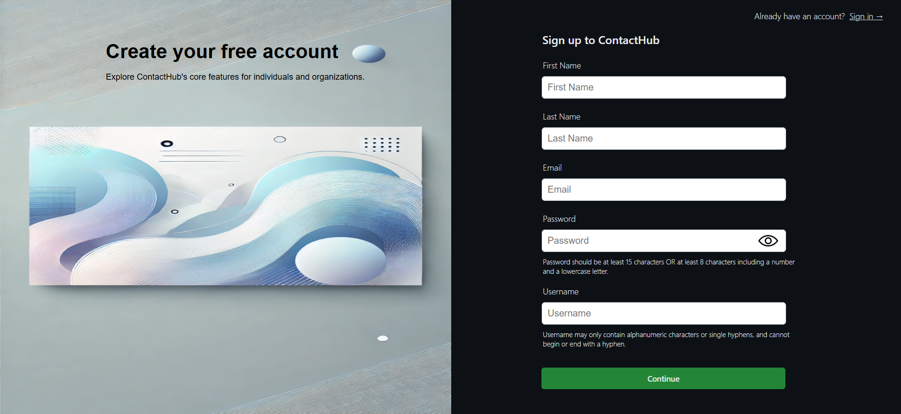
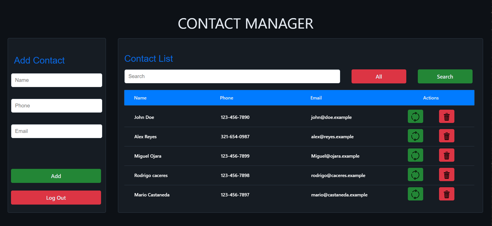

# 📇 Welcome to ContactHub - A Contact Management System  
**PHP | MySQL | HTML | CSS | JavaScript | Apache | Linux (LAMP Stack)**

**ContactHub** is a full-featured contact management system built with the LAMP stack. It provides an intuitive interface to store, organize, and manage personal or professional contacts while ensuring secure access and consistent data backups. This project was done with the intention of demonstrating my understanding of the basics.

 

## 🏠  Home 

  

## 🔐 Create Account   

  

## 📋 Manage Contacts  

  

 

## ✨ **Key Features:**
- **User Authentication** – Secure login system to manage access  
- **CRUD Operations** – Add, view, edit, and delete contacts seamlessly  
- **Search & Filter** – Quickly locate contacts using dynamic filters  
- **Automated Backups** – Scheduled MySQL backups for data protection  
- **Responsive UI** – Clean and modern interface for desktop 

 

## 🛠 **Technologies Used:**
- **PHP** – Server-side logic and data handling  
- **MySQL** – Relational database for contact storage  
- **HTML/CSS/JavaScript** – Front-end structure and interactivity  
- **Apache** – Web server for handling requests  
- **Linux** – Hosting and deployment environment
